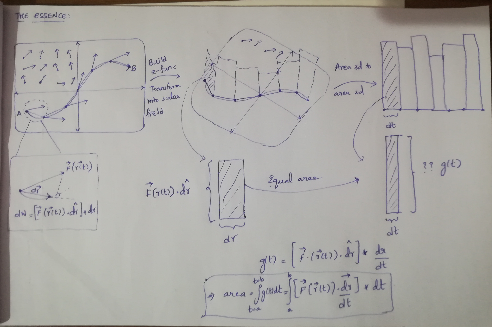

# Line Integrals of Vector Fields

## Essence



## IntroScene

Hey everyone, Abhijith here! In my previous video I shared my perspective on the line integrals of scalar fields where I have discussed how you can tranform the area of a curtain like shape in 3D into a regular 2D integral. In this video, we'll be doing something similar, but with **Vector Field**s this time.

The typical way this concept is introduced is via the work done by a force-field in moving an object along a certain path. I'll also take the same approach, but I believe I can still offer a fresh perspective walking you through how the physical question of calculating the work done by a force-field translates into a question of finding area underneath a graph - the regular 2D integrals we all are familiar with. So stick around till the end and I hope you'll find the video informative. Going forward, I'll assume that you are familiar with the concepts of work done by a constant force and the dot products of vectors. Let's start by briefly talking about vector fields.

## WhatAreVectorFields

I believe most of you, atleast those from India, might have done this experiment in your physics lab where you take a **bar magnet**, a **compass** and start drawing a bunch of arrows around the magnet depending on the direction in which the compass points to at a certain point. You might have not realized it back then, but you've essentially drawn a vector field - one that loosely represents the magnetic force exerted by the bar magnet around it. You've basically assigned vectors to points in space.

```
BarMagnet
Compass (SVGMobject?)
```

That's what vector fields are - functions that take vector inputs, which we think of as the coordinates of points in space, and return aother vector as an output, which we'd attach to those points. You might recollect scalar fields which are functions that return a scalar from a vector input, which we visualize as assigning a height in the perpendicular dimension to a point in 2D. But with vector fields, we assign vectors to points in space. It's a common practice to let the color vaguely represent the actual length of vectors to avoid clutter.

```
Vector3D (requires Cylinder, Cone, Line3D)
VectorField3D
StreamLines3D
```

## WorkDoneAndTheBigIdea

- Consider the vector field defined by the function **F**(x, y). What we are interested in, is the work done by this field in moving a particle along a curve defined by the parametric function **r**(t) as **t** goes from **a** to **b**. How do we proceed with this problem?

- Work done by a constant force in moving an object along a straight line path is the product of the component of force along the displacement, times the magnitude of displacement.

  1. So in our attempt to solve this problem, let us assume that the particle travels not exactly along the curve, but along (secant?) lines connecting the points on the curve - because dealing with linear motion is something that we're comfortable with. These points are the outputs of the parametric function **r** for samples of inputs **t** evenly spaced out by a width **$\triangle t$**, which is **xyz** in this case.

  2. We'll also assume that whatever force acts on the particle at the beginning of each line, continues to act throughout that line.

- With these assumptions in mind, let's calculate the work done along one of these lines. We'll first have to calculate the component of force acting in the direction of the displacement vector. We do that by taking the dot product of the force vector and the **unit** displacement vector. Now that we have the force acting in the direction of dispalcement, multiplying it with the magnitude of displacement gives us the work done along that path.

  - Whenever I see a product of 2 numbers, I immediately picture a rectangle with those dimensions. We can visualize this work done as the area of a rectangle whose width is equal to the length of the displacement vector and whose height is the dot product - the component of force along the displacement.
  - At the beginning of the video, I promised you to show that the work done by the vector field transforms into an area under a graph. Do you see where this video is heading towards? You might feel like this is an unneccessary complication at this point, but you'll hopefully appreciate this idea
    by the end of this video.
  - If we repeat the process for all the lines in our approximate path and take the summation of individual works done, we end up with an approximation of the actual work that would've been done had the particle followed the exact path.

- As always in calculus, in order to refine our approximation, we sample more and more points along the curve by letting **$\triangle t$** approach zero. As a consequence, our approximate path converges towards the actual path. And since our samples along the curve get more and more tightly packed, the forces acting on the particle become increasingly better approximations of the actual forces exerted by the field.

  - So both the assumptions are relaxed as **$\triangle t$** approaches zero. That's when the summation becomes an integral over the limits 0 and whatever the arc length of the curve is . But how do you even evaluate this integral? The integrand is a function of **t**, but the integration variable is something else. The fact that the variable **t** has a range of values going between **a** and **b** and that the integrand is already a function of **t** should motivate to think that maybe we can express this integral as an integral w.r.t **t** of _some_ function, say **g(t)**. What this means in the context of our visuals is that **we want all our rectangles to have a width $\triangle t$, while maintaing their original area!**

  - If you have a recangle of dimensions **a x b** and you want to rescale it to a new width **w** while maintaing the original area, the new height of the rectangle would be **(a x b) / w**.

  - That means, our new height function, **g(t)** would be, the original area, divided by the new width **$\triangle t$**. And as **$\triangle t$** approaches zero in the limit, the aggregate area representing the work done by the field approaches the area under the graph of the function **g(t)**.
    **QED**!
